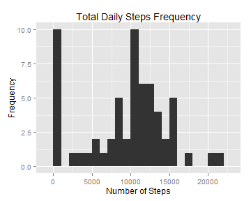

### Loading and preprocessing the data
Read in the data file, assuming it resides in current working directory

```r
activityData  <- read.csv("activity.csv", header = TRUE, colClasses = c("integer", "Date", "integer"))
```
### What is mean total number of steps taken per day?
Load the packages

```r
library(dplyr)
library(ggplot2)
library(chron)
```
### Calculate total steps for each day
First group the activity data by each date, find total of steps taken

```r
data <- activityData %>% 
        group_by(date) %>% 
        summarise(DayTotal = sum(steps, na.rm = TRUE))
```
### Create a histogram of total steps taken each day
Below is the histogram of the total number of steps taken each day.

```r
qplot(data$DayTotal, geom = "histogram", binwidth = 1000,  main ="Total Daily Steps Frequency", xlab = "Number of Steps", ylab = "Frequency" )
```

 

Now we calculate and report the mean and median of the total number of steps taken per day

```r
meanVal  <- format( mean( data$DayTotal, na.rm = TRUE), digits = 0)
medianVal <- format( median( data$DayTotal, na.rm = TRUE), digits = 0)
```
For the total number of steps per day, the mean is **9354** and the median is **10395** .

### What is the average daily activity pattern?
First group the activity data by each interval, find average of steps taken

```r
ordData  <-  activityData[ order(activityData$interval), ]
dataIntMean <- ordData %>% 
                group_by(interval) %>% 
                summarise( IntAvg = round(mean(steps, na.rm = TRUE)) )
```

Below is time series plot of the 5-minute interval and the average number of steps taken, averaged across all days.

```r
par(mar = c(5,4,4,4))
ggplot( dataIntMean, aes(interval, IntAvg) ) + geom_line() +  ylab("Average number of steps") + xlab("5-minute interval")
```

 

Here we find maximum average number

```r
IntMaxSteps <-  dataIntMean[which.max(dataIntMean$IntAvg) ,]
maxInt  <- IntMaxSteps$interval
maxSteps  <- format(IntMaxSteps$IntAvg, digits = 0)
```
The 5-minute interval **835** has maximum average number of steps **206**.

### Imputing missing values
Finding total number of missing values (NAs)

```r
dataMissing <- activityData %>% 
               group_by(date)
d <- sum( is.na( dataMissing$steps ))
```
The total number of missing values (coded as NA) in dataset is **2304**.

Imputing missing values with the mean for that 5-minute interval **(Mean Imputation Strategy)**

```r
mergedDf <- merge(x = activityData, y = dataIntMean, by = "interval", all.x = TRUE)
mergedDf <- mergedDf[order(mergedDf$date), ]
```
Creating a new dataset with imputed values

```r
imputeDf <- mergedDf
index  <- is.na(imputeDf$steps)
imputeDf$steps[index]  <- imputeDf$IntAvg[index]

imputedata <- imputeDf %>% 
                group_by(date) %>% 
                summarise(DayTotal = sum(steps))
```
Here is a histogram of the total number of steps taken each day with imputed missing values.

```r
qplot(imputedata$DayTotal, geom = "histogram", binwidth = 1000,  main ="Total Daily Steps Frequency\n(imputed data)", xlab = "Number of Steps", ylab = "Frequency" )
```

 

```r
imeanVal  <- as.integer(format( mean( imputedata$DayTotal), digits = 0))
imedianVal <-  as.integer(format( median( imputedata$DayTotal), digits = 0))
```
After imputing missing values, for the total number of steps per day, the mean is **10765** and the median is **10762** . These values are higher than original data's mean (9354) and median (10395) values. Using Mean imputation is a very simple approach, but it can severly distort the distribution, complicate summary measures and result in erroneous Standard deviation.

### Are there differences in activity patterns between weekdays and weekends?
Adding new column to imputed data, DayType. Using chron package, is.weekend(), we determine if a day is weekend or weekday.

```r
imputeDf[, "DayType"]  <- factor("weekend", "weekday")
imputeDf$DayType <- ifelse(is.weekend(imputeDf$date), "weekend", "weekday")
```
Here is a panel plot containing a time series plot of the 5-minute interval (x-axis) and the average number of steps taken, averaged across all weekday days or weekend days (y-axis). 

```r
plotData <-  aggregate(steps ~ interval + DayType, data = imputeDf, mean)
ggplot(plotData, aes(interval, steps)) + geom_line() + facet_grid(DayType ~ .) + xlab("5-minute Interval") + ylab("Number of Steps")
```

 


There is difference in the activity patterns. From the graph, we observe that number of steps taken in weekends are more than taken on the weekdays. 
